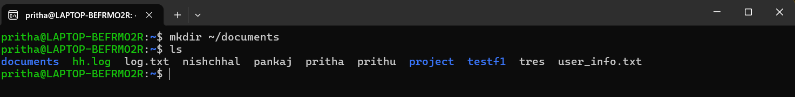
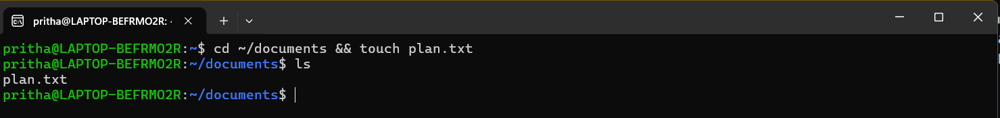
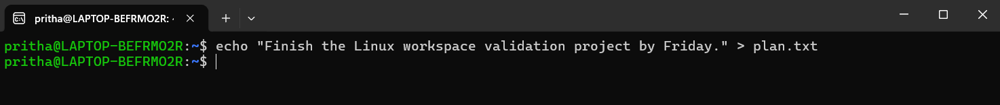
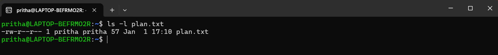
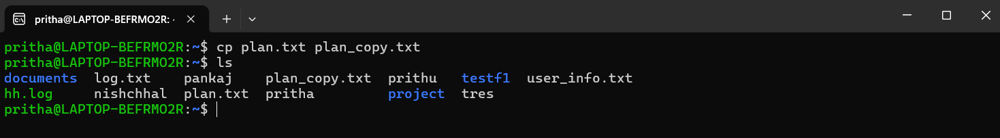
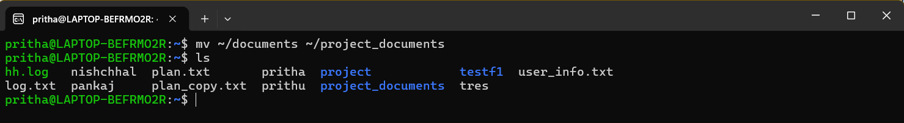
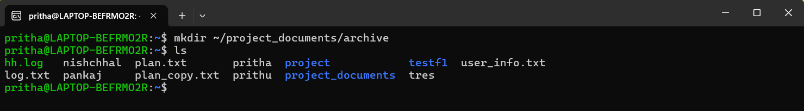
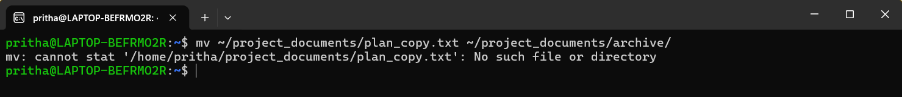
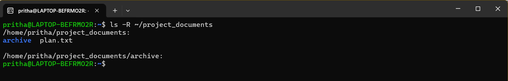
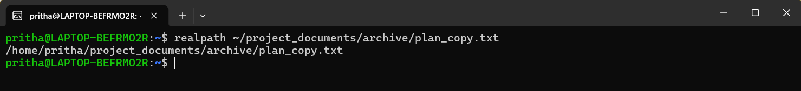

## **Command Line Interface Graded Lab Assignment, submitted by Pritha Aggarwal**

Linux Commands testing assignment  
Personal Ubuntu Used-

### **Question2**  
You are working as a junior system administrator responsible for organizing project- related files in your home directory. Your supervisor wants you to demonstrate your understanding of Linux file and directory management commands.

**1** Project Workspace Setup. Create a directory named documents inside your home directory. This directory will store your project-related files.  
**Command**:
```bash
mkdir ~/documents
```
**Output**:  
  
Explanation: **'mkdir'** command is used to create a directory. **'~/'** is used to represent the home directory (route to home dir). **'documents'** is the name of the new folder to be created.

**2** File Creation. Navigate into the documents directory and create a file named plan.txt.  
**Command**:
```bash
cd ~/documents && touch plan.txt
```
**Output**:  
  
Explanation: **'cd'** creates a directory. **'~/document'** creates a directory named documents in the home directory. **'&&'** ensures that 2nd command runs only if first is executed. **'touch plan.txt'** creates a file named plan.txt. 

**3** Content Addition. Write some sample text of your choice into the plan.txt file. The content can be a short project note or reminder.  
**Command**:
```bash
echo "Finish the Linux workspace validation project by Friday." > plan.txt
```
**Output**:  
  
Explanation: **'echo'** writes the given text. **'> plan.txt'** redirects to file plan.txt (creates new if not existing) and overwrites.

**4** File Metadata Verification. Display the permissions and ownership details of the plan.txt file. Ensure your username appears in the output.  
**Command**:
```bash
ls -l plan.txt
```
**Output**:   
  
Explanation: **'ls -l'** gives the list of files in long format (permissions, owner, groups, timestamps..). **'plan.txt'** is the file we have to verify.

**5** File Duplication. Create a copy of plan.txt and name it plan_copy.txt.  
**Command**:
```bash
cp plan.txt plan_copy.txt
```
**Output**:  
  
Explanation: **'cp'** command is used to copy files and directories. **'plan.txt'** is the file name we have to copy and change. **'plan_copy.txt'** is the name of new file.

**6** Directory Renaming. Rename the documents directory to project_documents to reflect the project scope more clearly.  
**Command**:
```bash
mv ~/documents ~/project_documents
```
**Output**:  
  
Explanation: **'mv'** command is used to move or rename the files and directories. **'~/documents'** is the directory (source). **~/project_documents** is the new name for directory (destination).

**7**  Archival Structure. Inside the project_documents directory, create a subdirectory named archive.  
**Command**:
```bash
mkdir ~/project_documents/archive
```
**Output**:  
  
Explanation: **'mkdir'** makes the directory. **'~/project_documents'** is path to parent directory. **'/archive'** is the new subdirectory. 

**8**  File Organization. Move plan_copy.txt into the archive subdirectory.  
**Command**:
```bash
mv ~/project_documents/plan_copy.txt ~/project_documents/archive/
```
**Output**:  
  
Explanation: **'mv'** moves files or directories. **'~/project_documents/plan_copy.txt'** is the current location of the file. **'~/project_documents/archive/'** is the location where the file has to be moved to. 

**9** Recursive Listing. List all files and subdirectories inside project_documents recursively so that the complete directory structure is visible.  
Command:
```bash
ls -R ~/project_documents
```
Output:  
  
Explanation: **'ls'** lists the directory contents. **'-R'** gives the command to list all subdirectories and the files within them. **'~/project_documents'** is the target directory.

**10** Path Verification. Display the absolute path of the plan_copy.txt file after it has been moved to the archive directory.  
Command:
```bash
realpath ~/project_documents/archive/plan_copy.txt
```
Output:  
  
Explanation: **'realpath'** is the primary Linux utility used to resolve and display full path of a file or directory. **'~/project_documents/archive/plan_copy.txt'** is the specific file path to be resolved, using the ~ shortcut for my home directory.