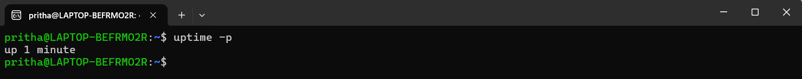
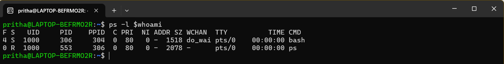
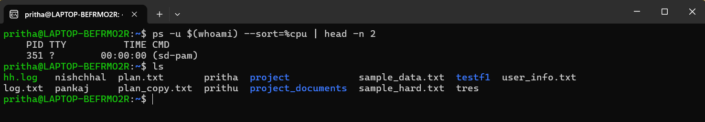
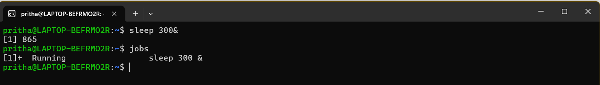
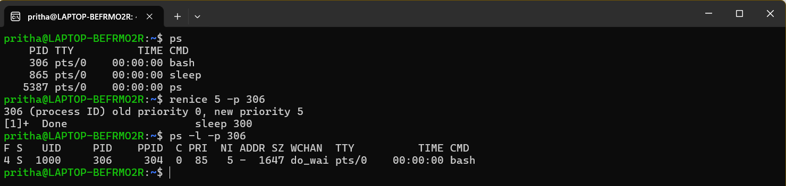
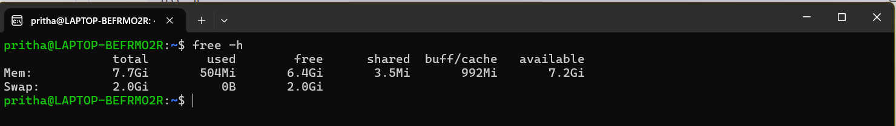
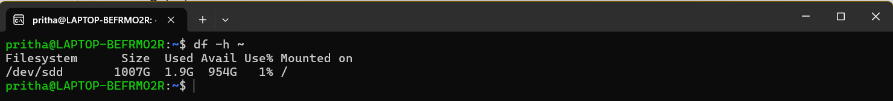
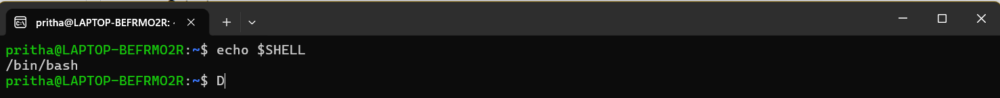
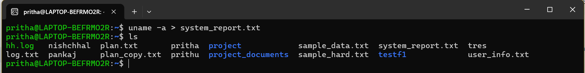
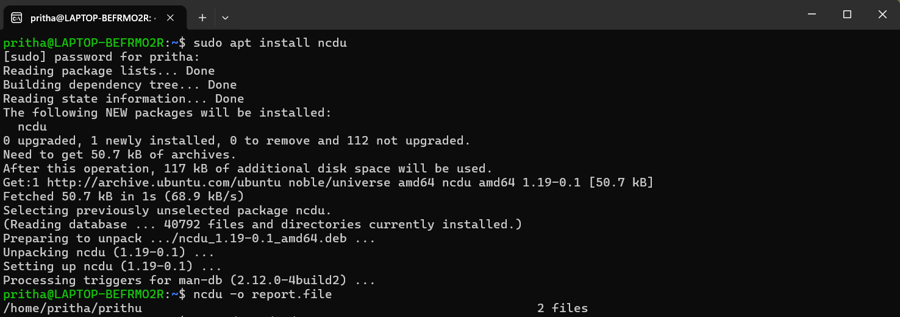

## **Command Line Interface Graded Lab Assignment, submitted by Pritha Aggarwal**

Linux Commands testing assignment  
Personal Ubuntu Used-

### **Question4**  
You have been asked to understand how Linux manages files using links and disk usage information.As part of your role, you will perform the following operations within your own user space.

**1** System Uptime Verification. Display the time elapsed since the system was last booted. 

**Command**:
```bash
uptime -p
```
**Output**:  
  
Explanation: **'uptime'** is the standard utility for checking how long the system has been active. **'-p'** formats the output in a clear understandable format.

**2** User Process Listing. List all processes currently running under your user account.  

**Command**:
```bash
ps l $whoami
```
**Output**:  
  
Explanation: **'ps'** command returns all the proccesses for current user. **'l'** specifies the result in a long format. **'$whoami'** inserts the current user's name.

**3** CPU Usage Analysis. Identify the process that is consuming the highest CPU usage among your running processes.  

**Command**:
```bash
ps -u $(whoami) --sort=-%cpu | head -n 2
```
**Output**:  
  
Explanation: **'ps -u'** gives the process id and sort them in user format. **'--sort=%cpu'** sorts the resulting list in descending order. **'|'** is the logical OR. **'head -n 2'** displays the header and the first process.

**4** Background Process Execution. Start a command in the background and verify that it is running. 

**Command**:
```bash
sleep 300 &
jobs
```
**Output**:  
  
Explanation: **'sleep 300'** is the command for a process to begin **'&'** is a special utility which when added after any command, makes it a background process. **'jobs'** command returns the background jobs running.

**5** Process Priority Management. Change the priority (niceness) of one of your running processes and display the updated priority. 

**Command**:
```bash
renice 5 -p 306
ps -l -p 306
```
**Output**:  
  
Explanation:  
**renice +5**: Increases the niceness by 5, making the process a lower priority for the CPU.  
**-p 306**: 306 is the specific Process ID we have to modify.  
**-l -p 306**: Show the PID, the NI (Nice value), and the command name.

**6** Memory Usage Monitoring. Display memory usage information in a human-readable format. 

**Command**:
```bash
free -h 
```
**Output**:
  
Explanation: **'free'** command lists the available/used/total memory (RAM) available in the system. **'-h'** converts the result from raw bytes to human readable form i.e. KB, GB, etc.

**7**  Disk Space Inspection. Display the disk space usage of the filesystem where your home directory resides.  

**Command**:
```bash
df -h ~
```
**Output**:  
  
Explanation: **'df'** command is used to check the file system disk usage. **'-h'** gives the size from raw bytes to human readable form. **'~'** is a shortcut to target the file system where the home directory is.

**8**  Shell Identification. Display the name of the shell currently in use. 

**Command**:
```bash
echo $SHELL
```
**Output**:  
  
Explanation: **'echo'** command displays the text. **'$SHELL'** stores the full path to the default login shell.

**9** Output Redirection. Redirect the output of a system information command of your choice into a file named system_report.txt.   

**Command**:
```bash
uname -a > system_report.txt
```
**Output**:  
  
Explanation: **'uname -a'** stores the comprehensive syste information. **'>'** directs to the file if existing or create a new. **'system_report.txt'** is the target file.

**10** Disk Usage Visualization. Demonstrate the usage of the ncdu tool using appropriate options and briefly explain what it shows.
  
**Command**:
```bash
ncdu -o report.file
```
**Output**:  
  
Explanation:  
**Basic Scan**: ncdu scans the current directory and sorts contents by size.  
**Targeted Scan**: ncdu /path/to/directory analyzes a specific folder.  
**Single Filesystem**: ncdu -x / ensures the scan stays on the local filesystem and does not follow mounts like network drives.  
**Export/Import**: ncdu -o report.file saves scan results to be viewed later with ncdu -f report.file, which is useful for remote servers.  